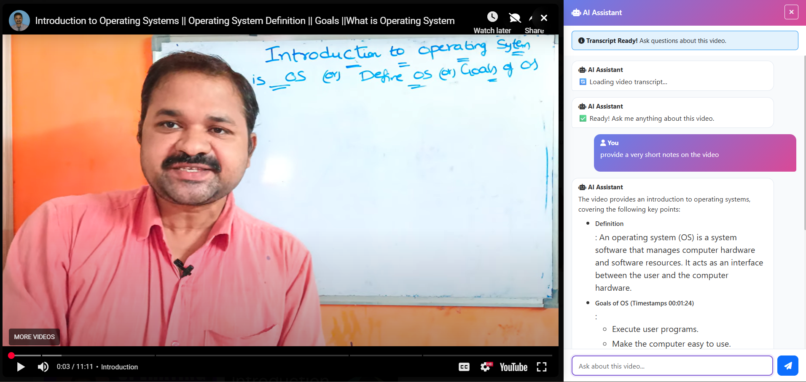
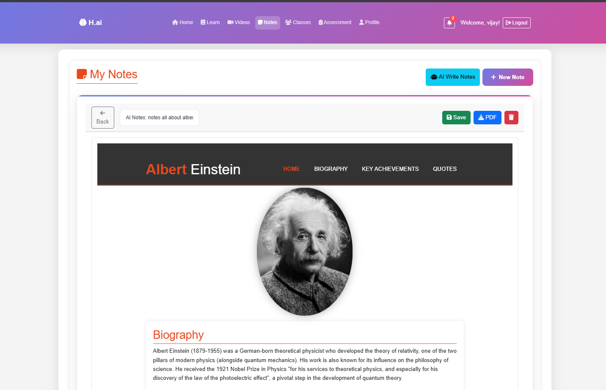

# HAI Render - AI-Powered Educational Platform


## Overview

**HAI Render** is a comprehensive AI-powered educational platform designed to revolutionize learning and teaching through intelligent document analysis, interactive question-answering, multimedia integration, and advanced classroom management. Built with cutting-edge artificial intelligence, HAI Render empowers both students and teachers to create dynamic, personalized learning experiences.


## 🎯 Key Features

### 1. 📚 Chat with Documents
Engage in intelligent conversations with your course materials and documents. The platform allows students to:
- Upload PDF, DOCX, and text files
- Ask natural language questions about document content
- Get context-aware answers directly from source material
- Track references to specific sections and pages
- Generate summaries of complex documents
- Extract key concepts and learning points
  

### 2. ❓ Question & Answer System
A robust Q&A framework that facilitates learning through queries:
- Student-generated and AI-curated questions
- Answer verification and quality assurance
- Discussion threads for peer learning
- Expert review capabilities
- Knowledge base construction
- Search and filtering by topic, difficulty, and relevance
- 

### 3. 🎥 YouTube Integration
Seamlessly incorporate video content into your curriculum:
- Direct YouTube video embedding
- Automatic transcript extraction and analysis
- Interactive video Q&A - ask questions about video content
- Timestamp-based bookmarking
- Video-based assignments and learning activities
- Content recommendation based on learning objectives
  

### 4. 📋 Assignment Management
Comprehensive assignment handling for structured learning:
- Create, distribute, and manage assignments
- Multiple submission types (text, files, URLs)
- Deadline tracking and notifications
- Rubric-based grading frameworks
- Automatic plagiarism detection
- Peer review functionality
- Batch operations for bulk assignment creation

### 5. 📊 Progress Tracking
Monitor learning journey with detailed analytics:
- Individual student progress dashboards
- Assignment completion rates and scores
- Time spent on materials and activities
- Learning objective achievement metrics
- Skill development tracking
- Performance trends and predictions
- Custom progress reports

### 6. 🏫 AI Classroom with Teacher Integration
A complete classroom management system powered by AI:
- Virtual classroom environment for real-time and asynchronous learning
- Teacher dashboard for class management
- Student roster and enrollment management
- Class-wide announcements and communications
- Resource sharing and organization
- Attendance tracking (where applicable)
- Real-time feedback and grading tools
  

### 7. 👨‍🎓 Student Metrics & Analytics
Advanced analytics to understand student performance:
- Engagement metrics (activity frequency, time on platform)
- Learning outcome assessments
- Knowledge gap identification
- Comparative performance analysis
- Behavioral patterns and learning style insights
- Predictive analytics for at-risk student identification
- Customizable metric dashboards

### 8. 🤖 AI-Generated Course Materials
Automatically generate educational content with AI:
- Auto-generated lecture notes from documents and videos
- Intelligent quiz and test creation
- Study guide generation
- Concept map visualization
- Glossary of terms extraction
- Practice problem generation based on learning objectives
- Personalized learning paths and recommendations
  

## 🚀 Getting Started

### Prerequisites
- Node.js (v14.0.0 or higher)
- Python (v3.8 or higher)
- MongoDB or compatible database
- Modern web browser (Chrome, Firefox, Safari, Edge)

### Installation

1. **Clone the repository**
   ```bash
   git clone https://github.com/javalabgit/hai-render.git
   cd hai-render
   ```

2. **Install dependencies**
   ```bash
   # Backend dependencies
   pip install -r requirements.txt
   
   # Frontend dependencies
   npm install
   ```

3. **Configure environment variables**
   ```bash
   cp .env.example .env
   # Edit .env with your configuration
   ```

4. **Initialize database**
   ```bash
   python manage.py migrate
   npm run db:seed
   ```

5. **Start the development server**
   ```bash
   # Terminal 1: Backend
   python manage.py runserver
   
   # Terminal 2: Frontend
   npm start
   ```

The application will be available at `http://localhost:3000`

## 📖 Usage Guide

### For Students

1. **Getting Started**
   - Register for an account or join a class via invitation code
   - Complete your profile and learning preferences
   - Join your assigned courses and classrooms

2. **Document Chat**
   - Navigate to a course's Documents section
   - Upload a document or select from course materials
   - Click "Chat with Document" to start an interactive session
   - Ask questions in natural language

3. **Participate in Q&A**
   - Browse course Q&A section
   - Ask new questions or search existing ones
   - Provide answers and learn from peer discussions
   - Rate and bookmark helpful answers

4. **Watch YouTube Videos**
   - Access video content from your course dashboard
   - Watch videos with embedded transcripts
   - Ask questions about video content
   - Complete video-based assignments

5. **Complete Assignments**
   - View assigned work with descriptions and rubrics
   - Submit assignments before deadlines
   - Receive AI-powered feedback
   - Track your progress

6. **Monitor Your Progress**
   - Check your personal progress dashboard
   - Review performance metrics and achievements
   - Identify areas for improvement
   - Track completion of learning objectives

### For Teachers

1. **Class Setup**
   - Create new courses and classrooms
   - Add course materials and resources
   - Invite students via email or invite codes
   - Configure classroom settings and policies

2. **Create Assignments**
   - Design assignments with clear objectives
   - Set deadlines and grading rubrics
   - Configure submission types
   - Create multiple assignment variants for different groups

3. **Manage Content**
   - Upload documents and course materials
   - Embed YouTube videos
   - Generate AI-created materials for your course
   - Organize resources by unit or topic

4. **Monitor Class Performance**
   - View comprehensive class analytics dashboard
   - Identify struggling students
   - Track assignment submission and grading
   - Generate performance reports

5. **Provide Feedback**
   - Grade assignments with AI assistance
   - Provide personalized feedback to students
   - View AI-generated insights about student learning
   - Schedule interventions for at-risk students

## 🏗️ Architecture

### Frontend
- **Framework**: React.js
- **State Management**: Redux
- **Styling**: Tailwind CSS
- **API Client**: Axios

### Backend
- **Framework**: Django/Flask
- **Database**: MongoDB/PostgreSQL
- **AI/ML**: TensorFlow, scikit-learn, Hugging Face Transformers
- **Document Processing**: PyPDF2, python-docx, Tesseract OCR
- **Video Processing**: YouTube API, FFmpeg

### Key Services
- Authentication & Authorization
- Document Processing & Analysis
- Question-Answering Engine
- Video Content Management
- Assignment Management
- Analytics & Reporting
- AI Content Generation

## 📁 Project Structure

```
hai-render/
├── frontend/                 # React frontend application
│   ├── src/
│   │   ├── components/      # Reusable React components
│   │   ├── pages/           # Page components
│   │   ├── services/        # API services
│   │   └── utils/           # Utility functions
│   └── public/
├── backend/                  # Python backend application
│   ├── app/
│   │   ├── models/          # Database models
│   │   ├── views/           # API endpoints
│   │   ├── services/        # Business logic
│   │   └── utils/           # Utility functions
│   ├── ai/                  # AI/ML modules
│   │   ├── qa/              # Q&A system
│   │   ├── nlp/             # NLP processing
│   │   └── generation/      # Content generation
│   └── tests/               # Test suites
├── docs/                     # Documentation
├── docker-compose.yml        # Docker configuration
└── requirements.txt          # Python dependencies
```

## 🔑 API Endpoints

### Document Management
- `POST /api/documents/upload` - Upload a new document
- `GET /api/documents/:id` - Retrieve document details
- `DELETE /api/documents/:id` - Delete a document
- `POST /api/documents/:id/chat` - Chat with document

### Questions & Answers
- `POST /api/qa/questions` - Create a new question
- `GET /api/qa/questions` - List questions
- `POST /api/qa/questions/:id/answers` - Submit answer
- `PUT /api/qa/answers/:id/rate` - Rate an answer

### Videos
- `POST /api/videos/embed` - Add YouTube video
- `GET /api/videos/:id/transcript` - Get video transcript
- `POST /api/videos/:id/questions` - Ask about video

### Assignments
- `POST /api/assignments` - Create assignment
- `GET /api/assignments/:id` - Get assignment details
- `POST /api/submissions` - Submit assignment
- `GET /api/submissions/:id/grade` - View submission grade

### Progress & Analytics
- `GET /api/students/:id/progress` - Get student progress
- `GET /api/classes/:id/metrics` - Get class metrics
- `GET /api/analytics/reports` - Generate performance reports

## 🔐 Security Features

- End-to-end encryption for sensitive data
- Role-based access control (RBAC)
- JWT-based authentication
- HTTPS/SSL encryption
- Data privacy compliance (GDPR, FERPA)
- Secure file upload handling
- SQL injection prevention
- Cross-site scripting (XSS) protection

## 🤝 Contributing

We welcome contributions from the community! Please follow these steps:

1. Fork the repository
2. Create a feature branch (`git checkout -b feature/amazing-feature`)
3. Commit your changes (`git commit -m 'Add amazing feature'`)
4. Push to the branch (`git push origin feature/amazing-feature`)
5. Open a Pull Request

Please read our [CONTRIBUTING.md](CONTRIBUTING.md) for detailed guidelines.

## 📝 License

This project is licensed under the MIT License - see the [LICENSE](LICENSE) file for details.

## 🐛 Bug Reports & Feature Requests

Found a bug? Want to suggest a feature? Please open an issue on our [GitHub Issues](https://github.com/javalabgit/hai-render/issues) page with:
- Clear description of the issue
- Steps to reproduce (for bugs)
- Expected vs actual behavior
- Screenshots or error logs (if applicable)

## 📧 Support & Contact

- **Documentation**: [Read the Docs](https://hai-render.readthedocs.io)
- **Issues**: [GitHub Issues](https://github.com/javalabgit/hai-render/issues)
- **Email**: support@hai-render.io
- **Community Forum**: [Discuss](https://discuss.hai-render.io)

## 🎓 Learning Resources

- [Getting Started Guide](docs/getting-started.md)
- [API Documentation](docs/api-reference.md)
- [User Guide](docs/user-guide.md)
- [Developer Guide](docs/developer-guide.md)
- [FAQ](docs/faq.md)

## 📊 Project Statistics

- **Total Features**: 8+ core features
- **Supported File Types**: PDF, DOCX, TXT, MP4, and more
- **AI Models Integrated**: Multiple state-of-the-art NLP models
- **Languages Supported**: 20+ languages
- **Concurrent Users**: Scalable to 10,000+ users

## 🗺️ Roadmap

### Version 2.0 (Q1 2025)
- [ ] Mobile application (iOS/Android)
- [ ] Real-time collaborative editing
- [ ] Advanced AI tutoring system
- [ ] Gamification features

### Version 2.5 (Q2 2025)
- [ ] Third-party LMS integration (Canvas, Blackboard)
- [ ] Advanced plagiarism detection
- [ ] Voice-enabled interface
- [ ] Enhanced accessibility features

### Version 3.0 (Q3 2025)
- [ ] AI-powered career guidance
- [ ] Corporate training modules
- [ ] Advanced data visualization
- [ ] Machine learning model customization

## ⭐ Acknowledgments

Special thanks to:
- Contributors and maintainers
- The open-source community
- Our beta testers and early users
- Educational institutions supporting the project

## 📄 Additional Resources

- [Terms of Service](docs/terms-of-service.md)
- [Privacy Policy](docs/privacy-policy.md)
- [Accessibility Statement](docs/accessibility.md)
- [Code of Conduct](CODE_OF_CONDUCT.md)

---

**Made with ❤️ for educators and learners worldwide**

*Last Updated: December 17, 2025*
